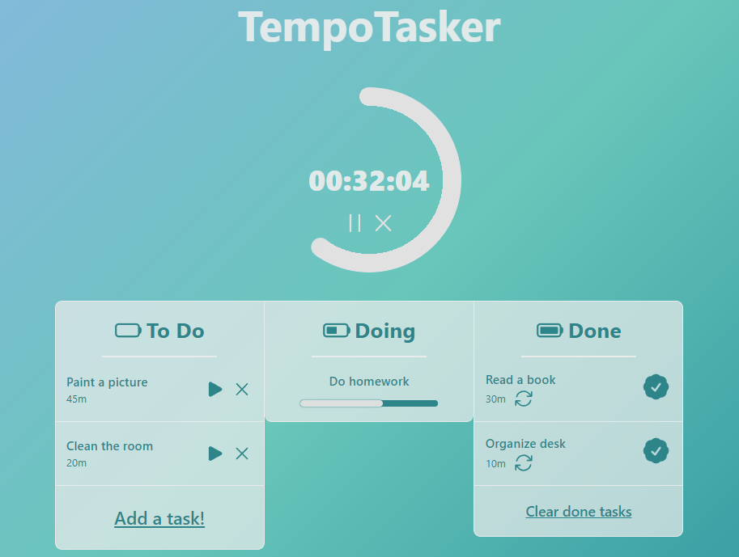

# Tempotasker

Tempotasker is a productivity-boosting web application developed using React and TypeScript. This platform empowers users to effortlessly organize their tasks, allocate dedicated time to each task, and seamlessly transition between task phases using built-in timers. Tempotasker ensures that your task management experience is efficient, satisfying, and focused, all while maintaining a responsive design that adapts seamlessly to various devices and screen sizes.

## Live Demo

Experience the power of Tempotasker by trying out the [Live Demo](https://juangh19.github.io/tempotasker/)!

## Features

- Add tasks and allocate time for each.
- Initiate task-specific timers.
- Transfer completed tasks to the "Completed Tasks" column.
- Easily move tasks back to the "To-Do Tasks" list for redoing.
- User-friendly interface for optimal task management.

## Usage

1. On the main page, three columns are presented: "To-Do Tasks", "Doing Tasks" and "Completed Tasks."

2. To add a new task, click "Add a task!", input the task description and the allocated time in minutes, then click "Add"

3. Once a task is added, initiate the timer by clicking the "Start" button on the task card.

4. Upon reaching the designated time, the task will automatically transition to the "Completed Tasks" column.

5. In the "Completed Tasks" section, you can press "Redo" button to move a task back to the "To-Do Tasks" list.

6. Steps 2-5 can be repeated for efficient task management.

## Tecnologies Used

- **React:** A JavaScript library for building user interfaces based on components.
- **TypeScript:** A typed superset of JavaScript that compiles to plain JavaScript.
- **CSS:** Utilized for styling the application.
- **npm:** A package manager for seamless management of project dependencies.

## Contributing

Contributions are warmly welcomed! To report issues or suggest improvements, feel free to create a pull request or submit an issue in the GitHub repository.
